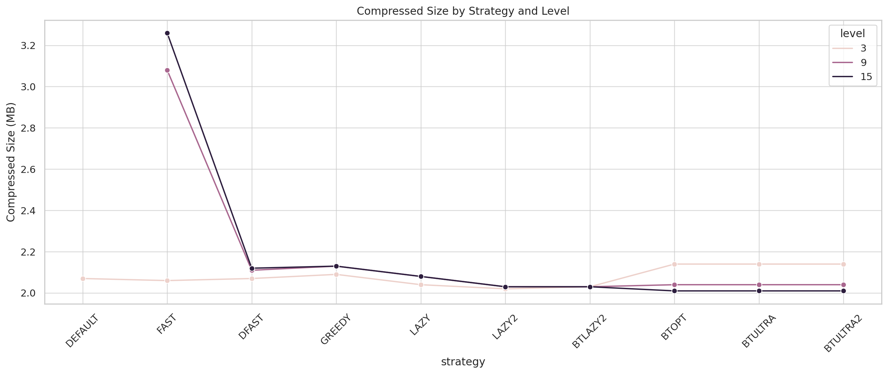
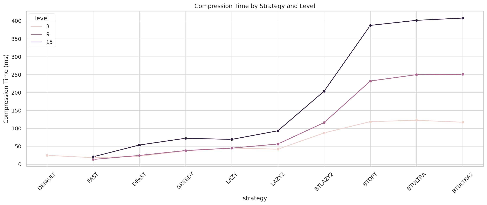
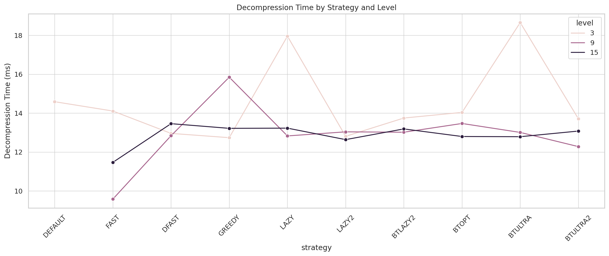
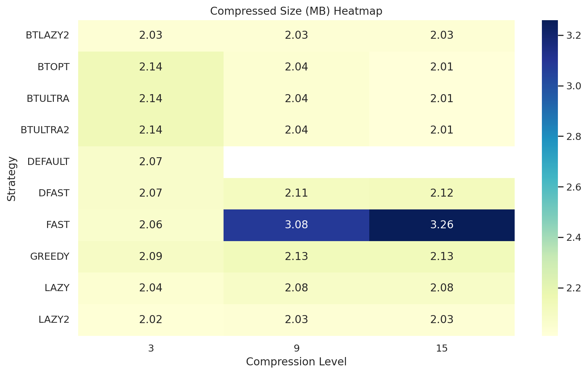
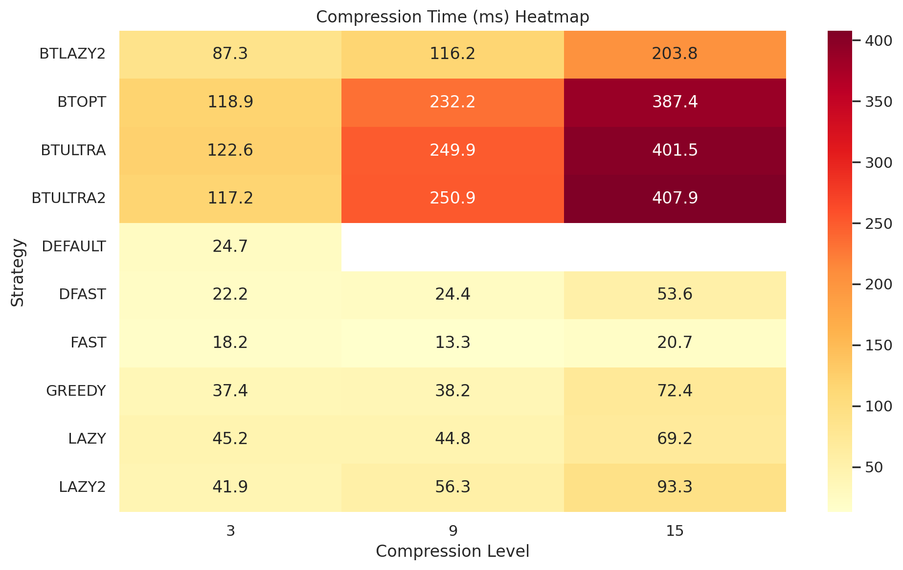
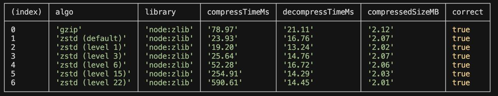

# Compression Benchmark: Gzip vs Zstd (Node.js)

This project benchmarks and compares the performance and compression efficiency of Gzip and Zstandard (zstd) algorithms using the native Node.js `zlib` module (Node.js v24+ required).

## Features

- **Compare Gzip and Zstd**: Speed, compression ratio, and decompression speed.
- **Test different zstd compression levels and strategies**.
- **Resource usage**: CPU time measurement for each compression.
- **Randomized, realistic transaction data for benchmarking.**

## Requirements

- **Node.js v24.0.0 or newer** (zstd support is experimental and only available in Node.js 24+)
- `npm` (for installing dependencies, if any)

## Files

- `src/compression-benchmark.ts` — Main benchmark: compares Gzip and Zstd at different compression levels.
- `src/zstd-strategy-benchmark.ts` — Advanced: compares all zstd compression strategies at a fixed level.

## How to Run

1. **Clone the repository:**
   ```sh
   git clone <your-repo-url>
   cd compression-benchmark
   ```
2. **Install dependencies (if any):**
   ```sh
   npm install
   ```
3. **Run the benchmarks:**
   - With ts-node (recommended for TypeScript):
     ```sh
     npx ts-node src/compression-benchmark.ts
     npx ts-node src/zstd-strategy-benchmark.ts
     ```
   - Or compile to JS and run with node:
     ```sh
     tsc src/compression-benchmark.ts
     tsc src/zstd-strategy-benchmark.ts
     node src/compression-benchmark.js
     node src/zstd-strategy-benchmark.js
     ```

## Example Output

```
┌─────────┬──────────────────────┬─────────────┬────────────────┬──────────────────┬────────────────┬─────────┐
│ (index) │ algo                 │ library     │ compressTimeMs │ decompressTimeMs │ compressedSize │ correct │
├─────────┼──────────────────────┼─────────────┼────────────────┼──────────────────┼────────────────┼─────────┤
│ 0       │ 'gzip'               │ 'node:zlib' │ '20.85'        │ '9.56'           │ 219633         │ true    │
│ 1       │ 'zstd (level 1)'     │ 'node:zlib' │ '8.97'         │ '8.36'           │ 198138         │ true    │
│ 2       │ 'zstd (level 3)'     │ 'node:zlib' │ '8.55'         │ '21.48'          │ 198138         │ true    │
│ ...     │ ...                  │ ...         │ ...            │ ...              │ ...            │ ...     │
└─────────┴──────────────────────┴─────────────┴────────────────┴──────────────────┴────────────────┴─────────┘
```

## Zstd Compression Parameters Example

You can fine-tune zstd compression in Node.js using the `params` option. Here are the most relevant parameters (see [Node.js zlib zstd constants](https://nodejs.org/api/zlib.html#zstd-constants)):

```js
params: {
  // Compression level: 1 (fastest) to 22 (strongest)
  [zlib.constants.ZSTD_c_compressionLevel]: 3,

  // Compression strategy: affects match search behavior and tradeoffs
  // Options: FAST < DFAST < GREEDY < LAZY < LAZY2 < BTLAZY2 < BTOPT < BTULTRA < BTULTRA2
  [zlib.constants.ZSTD_c_strategy]: zlib.constants.ZSTD_STRATEGY_FAST,

  // Enable or disable Long Distance Matching (LDM)
  // Useful for large payloads (multi-megabyte)
  [zlib.constants.ZSTD_c_enableLongDistanceMatching]: 0,

  // Maximum search window size (log2). Example: 27 → 128MB
  // Larger values increase compression ratio but use more memory
  [zlib.constants.ZSTD_c_windowLog]: 27,

  // Size of the hash table used to find matches (log2)
  [zlib.constants.ZSTD_c_hashLog]: 26,

  // Match chain length (log2) — used by certain strategies
  [zlib.constants.ZSTD_c_chainLog]: 26,

  // Search depth (log2) — how many potential matches to consider
  [zlib.constants.ZSTD_c_searchLog]: 5,

  // Target block size in bytes — useful for real-time compression tuning
  [zlib.constants.ZSTD_c_targetLength]: 0, // 0 = auto

  // Hint for input size — may improve performance slightly
  [zlib.constants.ZSTD_c_srcSizeHint]: 0,

  // Compression mode for literal bytes (non-matching data)
  // Options: AUTO (0), HUFFMAN (1), UNCOMPRESSED (2)
  [zlib.constants.ZSTD_c_literalCompressionMode]: zlib.constants.ZSTD_lcm_auto,

  // ===== Long Distance Matching (LDM) parameters =====

  // Hash table size for LDM (log2)
  [zlib.constants.ZSTD_c_ldmHashLog]: 26,

  // Minimum match length for LDM to trigger
  [zlib.constants.ZSTD_c_ldmMinMatch]: 64,

  // Bucket size for LDM hash entries (log2)
  [zlib.constants.ZSTD_c_ldmBucketSizeLog]: 3,

  // Hashing rate for LDM — higher = less frequent
  [zlib.constants.ZSTD_c_ldmHashRateLog]: 7,
}
```

## How it works

- **Random transaction data** is generated to simulate real-world payloads.
- **Compression and decompression** are performed for each algorithm/parameter set.
- **Metrics measured:**
  - Compression time (ms)
  - Decompression time (ms)
  - Compressed size (bytes)
  - CPU time (for strategy benchmark)
  - Correctness (data integrity after decompression)

## Customization

- You can change the number of transactions or the structure in the scripts.
- You can add more zstd parameters (see [Node.js zlib zstd constants](https://nodejs.org/api/zlib.html#zstd-constants)).

## License

MIT

## Example Charts & Screenshots

Below are example charts visualizing benchmark results:

**Compressed Size By Strategy And Level**



**Compression Time By Strategy And Level**



**Decompression Time By Strategy And Level**



**Compressed Size (MB) Heatmap**



**Compression Time (Ms) Heatmap**



**Zstd Default Level Benchmark**


